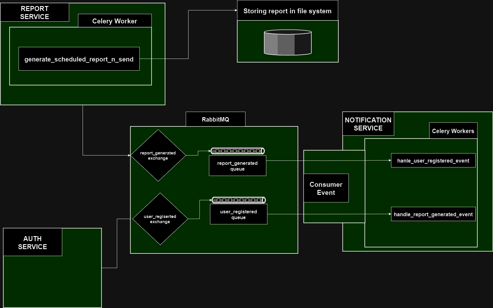

A cluser of lously coupled services build on Django Rest Framework (DRF) and JSON Web Token (JWT) tokens.
Uses Sendgrid and Twilio for real time email and SMS notification to greet users on regestration and then
send scheduled scheduled and on demand reports.

<!-- ABOUT THE PROJECT -->
## About The Project

